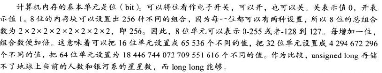
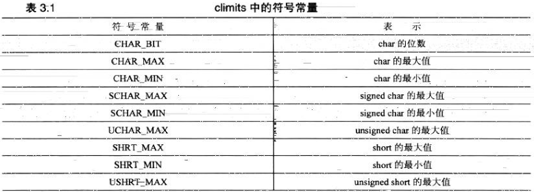
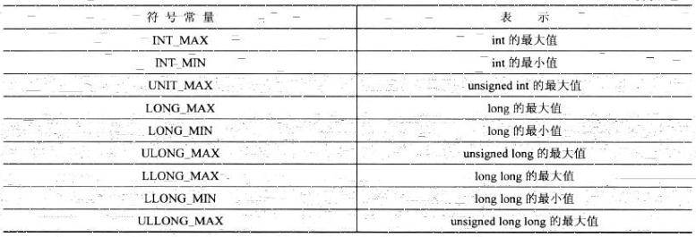
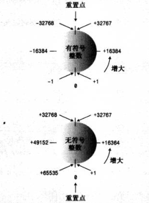
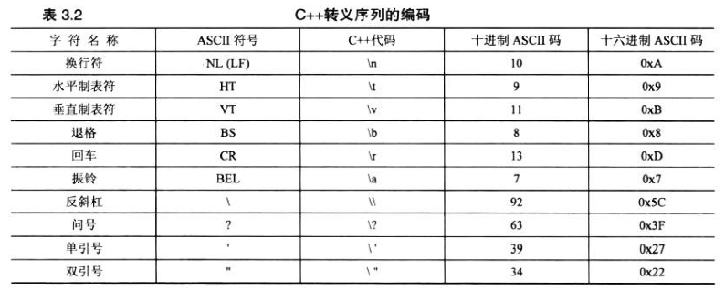
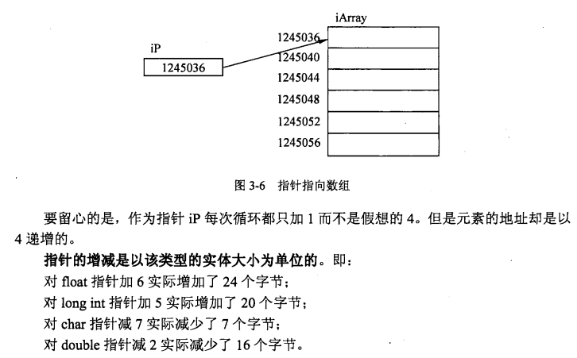
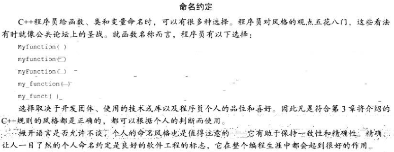
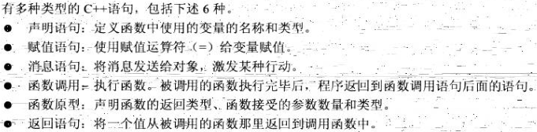

### Foundation
#### 1. 基础概念

- 面向对象三大特性

  - 封装

  将客观事物封装成抽象的类，并且类可以把自己的数据和方法只让可信的类或者对象操作，对不可信的进行消息隐藏。

  - 继承

  继承所表达的是类之间相关的关系，这种关系使得对象可以继承另外一类对象的特征和能力；

  继承的作用：避免公用代码的重复开发，减少代码和数据的冗余。

  - 多态

  多态可以简单地概括为“一个接口，多种方法”，字面意思为多种形态，程序在运行时才决定调用的函数，它是面向对象变成领域的核心概念。

- #include：对编译器打出的操作指令，指示编译器在编译之前，现将<>中的文件内容在本文件中展开。

```c++
#include<iostream>     //标准输入、输出的标准库头文件

using namespace std;    //命名空间，std::

void sphere();       //声明函数

//主函数，程序的入口，从main() 开始执行程序，int 表示main()函数应该返回一个整型值。
int main(){
	sphere();       //调用sphere函数
}

void sphere(){
	double radius;
	cout<<"Please input radius: ";
	cin>>radius;
	if(radius<0) return;
	cout<<"The result is "<<radius*radius*3.14*4<<"\n";
}
```

- Namespace

C++ 程序的入口总是int main()

- endl

输出换行病刷新缓冲区

```c++
cout<<""<<endl
```


#### 2.基础编程语句

##### 2.1. if语句

```c++
if(条件) 语句
if(条件) 语句1 else 语句2
```

#### 3. 数据类型

###### 变量名

C++提倡使用具有一定含义的变量名，例如==cost_of_trip==、==costOfTrip==。C++命名规则：

- 在名称中只能使用字母字符、数字和下划线；
- 名称的第一个字符不能是数字；
- 区别大小写字符；
- 不能将C++关键字作为名称；
- C++对于名称的长度灭有限制，名称中的所有字符都有意义，但是有些平台有长度限制。
- 以两个下划线或者下划线和大写字母大头的名称被保留给实现（编译器及其使用的资源）使用。以一个下划线开头的名称被保留给实现，用作全局标识符。

###### 整型

整数就是没有小数部分的数字，C++提供多种整型内存量来存储整数。C++的基本整型（按宽度递增）char（常用于表示字符）、short、int、long、long long，每种类型都有==符号版本和无符号==版本。



- short至少16位；
- int至少与short一样长；
- long至少32位，且至少与int一样长；
- long long至少64位，且至少与long一样长；

```c++
short score;
unsigned short score;
int temperature;
unsigned int tem;
long position;
unsigned long position;
```

```c++
#include <climits>
int的最大（最小）取值：INT_MAX(INT_MIN);
short:     SHRT_MAX(SHRT_MIN);
long :     LONG_MAX(LONG_MIN);
long long: LLONG_MAX(LLONG_MIN)
```





- 当程序试图超越整型的限制时，其值会变成另一端的取值。

  

- 整型数据的选择

  自然长度指的是计算机处理起来效率最高的长度，通常==int==被设置位对目标计算机而言最为“自然”的长度。如果表示的值不可能为负值，则可以使用无符号类型，这样变量可以表示更大的值。

- 整型字面值

  C++提供三种不同的计数方式来书写整数：基数为10（十进制）、基数为8（八进制）、基数为16（16进制）；根本上，这些数值都是以相同的方式存储到计算机中——被存储为二进制数。

- char类型：字符和小整数

  char是一种整型，char类型专门为存储字符（标点、符号、字母和单个数字等）

  - cout.put()

  - char字面值

    在C++中，字符常量的书写方式有很多，对于常规字符，简单的就是用==‘ ? ’==，这种表示法代表的是字符的数值编码（ASCII）。 

  

###### const限定符

const用于声明常量，常量一旦被初始化，其值就被固定了，编译器不允许该修改该常量的值。

```c++
// 通用格式
const type name = value;
// 错误格式
const int name;
name = 10;       //  如果在声明常量的时候没有提供值， 则该常量的值将是不稳定的，且无法修改。
```

###### 浮点类型

浮点数能够表示带有小数部分的数字，同时如果所需要表达的数值过大，则可以使用浮点类型进行表示。

```c++
double num = 12.34;
double num = 9.0;
double num = 5.20E+5;
double num = 8.33e-4;    //E表示法可以表示很大或者很小的数值；没有小数点依然可以用E表示法
```

float、double、long double三种浮点类型，这些类型是按他们可以表示的有效数位和允许的指数最小范围来描述。

###### 指针

C++ 拥有在运行时获得变量或者对象的地址和通过地址操纵数据的能力，这种能力是通过指针来发挥的。通过指针，可以简化一些 C++ 编程任务的执行，还有一些任务，如动态内存分配，没有指针是无法执行的。

每一个变量都有一个内存位置，通过‘&’运算符访问地址。

```c++
int var1;
char var2[10];
cout<<"var1变量的地址："<<&var1<<endl;
cout<<"var2变量的地址："<<&var2<<endl;
```

```
var1变量的地址：0x7ffd0109fa38
var2变量的地址：0x7ffd0109fa3e
```

- 指针：指针是一个变量，值为另一个变量的地址，即内存位置的直接地址。必须在使用指针存储其他变量地址前声明指针。

  ```c++
  [type] *var-name
  int *ip;		/*一个整型的指针*/
  double *dp;		/*一个double型的指针*/
  float *fp;
  char *ch;
  ```

  所有指针的值的实际数据类型，不管是整型、浮点型、字符型，还是其他的数据类型，都是一样的，都是一个代表内存地址的长的十六进制数。不同数据类型的指针之间唯一的不同是，指针所指向的变量或常量的数据类型不同。

  ```c++
  int var = 20;	//实际变量的声明
  int *ip;		//指针变量的声明
  ip = &var;		//在指针变量中存储var的地址
  cout<<"Value of var variable: "<<var<<endl;
  // 输出在变量指针中存储的地址
  cout<<"Address stored in ip variable: "<<ip<<endl;
  // 访问指针中地址的值
  cout<<"Value of *ip variable: "<<*ip<<endl;
  ```

  ```c++
  Value of var variable: 20
  Address stored in ip variable: 0x7fff09509f4c
  Value of *ip variable: 20
  ```

- Null 指针

  在变量声明的时候，如果没有确切的地址可以赋值，为指针变量赋一个NULL是一个良好的编程习惯。赋为NULL的指针被称为空指针。NULL指针是一个定义在标准库中的值为零的常量；

  ```c++
  int *ptr=NULL;
  cout<<"ptr的值是"<<ptr<<endl;
  
  >>>ptr的值是0
  ```

  在大多数的操作系统上，程序不允许访问地址为 0 的内存，因为该内存是操作系统保留的。然而，内存地址 0 有特别重要的意义，它表明该指针不指向一个可访问的内存位置。但按照惯例，如果指针包含空值（零值），则假定它不指向任何东西。

  如需检查一个空指针，您可以使用 if 语句，如下所示：

  ```c++
  if(ptr)
  if(!ptr)
  ```

  因此，如果所有未使用的指针都被赋予空值，同时避免使用空指针，就可以防止误用一个未初始化的指针。很多时候，未初始化的变量存有一些垃圾值，导致程序难以调试。

- 指针的算术运算

  指针是一个用数值表示的地址。因此，您可以对指针执行算术运算。可以对指针进行四种算术运算：++、--、+、-。不同类型的指针，递增或者递减内存位置的变化不一样，比如int型每次递增4。

  

- 指针与数组

  指针和数组是密切相关的。事实上，指针和数组在很多情况下是可以互换的。

#### 4.函数

用户自定义的函数需要定义在main函数的后面，并且需要在main函数之前进行声明，C++不允许函数定义嵌套在另一个函数中，每一个函数都是独立的，所有的函数的创建都是平等的。

函数的组成包括函数头与函数体；

函数格式：

```c++
type functionname(args)
{
    statements;
}
```

type——定义函数返回值得类型，int即返回整型数据，void——表明函数没有返回值。

args中，也会指定调用该函数应提供的参数类型。



- C++程序室友一个或多个被称为函数的模块组成。程序从main()函数开始执行，因此main函数不可或缺。函数是由函数头和函数体组成。函数头指出函数的返回值（如果有的话）的类型和函数期望通过参数传递给他的信息的类型。函数体由一系列位于{}中的C++语句组成。

  
