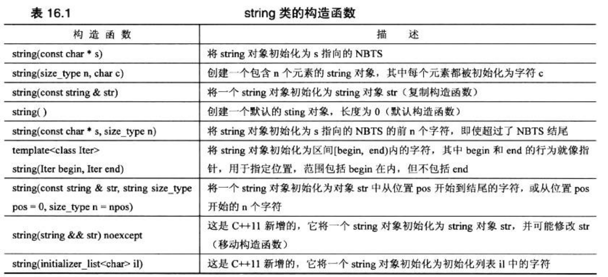
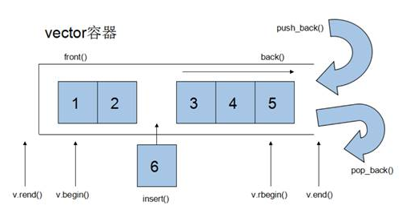
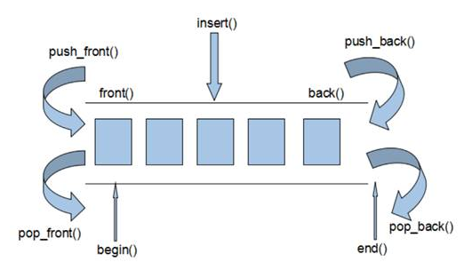
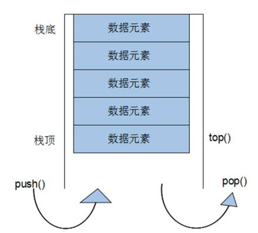
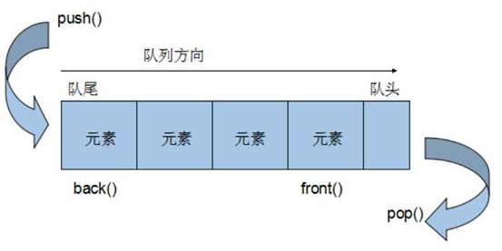
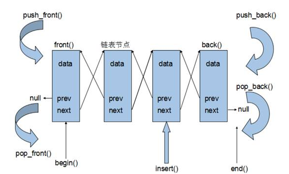

## STL

- STL（Standard Template Library，标准模板库）

- STL 从广义上分为: **容器(container) 、算法(algorithm) 、迭代器(iterator)**

- **容器**和**算法**之间通过**迭代器**进行无缝连接。
- STL 几乎所有的代码都采用了模板类或者模板函数

- STL大体分为六大组件，分别是:**容器、算法、迭代器、仿函数、适配器（配接器）、空间配置器**
  1. 容器：各种数据结构，如vector、list、deque、set、map等,用来存放数据。
  2. 算法：各种常用的算法，如sort、find、copy、for_each等。
  3. 迭代器：扮演了容器与算法之间的胶合剂。
  4. 仿函数：行为类似函数，可作为算法的某种策略。
  5. 适配器：一种用来修饰容器或者仿函数或迭代器接口的东西。
  6. 空间配置器：负责空间的配置与管理。

- **容器：**置物之所也

  STL**容器**就是将运用**最广泛的一些数据结构**实现出来

  常用的数据结构：数组, 链表,树, 栈, 队列, 集合, 映射表 等

  这些容器分为**序列式容器**和**关联式容器**两种:

   **序列式容器**:强调值的排序，序列式容器中的每个元素均有固定的位置。 **关联式容器**:二叉树结构，各元素之间没有严格的物理上的顺序关系

- **算法：**问题之解法也

  有限的步骤，解决逻辑或数学上的问题，这一门学科我们叫做算法(Algorithms)

  算法分为:**质变算法**和**非质变算法**。

  质变算法：是指运算过程中会更改区间内的元素的内容。例如拷贝，替换，删除等等

  非质变算法：是指运算过程中不会更改区间内的元素内容，例如查找、计数、遍历、寻找极值等等

- **迭代器：**容器和算法之间粘合剂

  提供一种方法，使之能够依序寻访某个容器所含的各个元素，而又无需暴露该容器的内部表示方式。

  每个容器都有自己专属的迭代器，迭代器使用非常类似于指针，初学阶段我们可以先理解迭代器为指针

#### 1. 容器

##### 1.1 string

- 基本概念

  string是C++风格的字符串，而string本质上是类

  - string和char * 的区别：

    char * 是一个指针；

    string是一个类，类内部封装了char* ，管理这个字符串，是一个char * 型的容器

- 特点：

  string类内部封装了很多成员方法；

  例如查找find、拷贝copy、删除delete等等。

###### 1.1.1 string构造

常用：

- `string();` //创建一个空的字符串 

  例如: string str; `string(const char* s);` //使用字符串s初始化

- `string(const string& str);` //使用一个string对象初始化另一个string对象

- `string(int n, char c);` //使用n个字符c初始化



###### 1.1.2 string赋值操作

给string字符串进行赋值；

赋值的函数原型：

- `string& operator=(const char* s);` //char*类型字符串 赋值给当前的字符串
- `string& operator=(const string &s);` //把字符串s赋给当前的字符串
- `string& operator=(char c);` //字符赋值给当前的字符串
- `string& assign(const char *s);` //把字符串s赋给当前的字符串
- `string& assign(const char *s, int n);` //把字符串s的前n个字符赋给当前的字符串
- `string& assign(const string &s);` //把字符串s赋给当前字符串
- `string& assign(int n, char c);` //用n个字符c赋给当前字符串

###### 1.1.3 string拼接操作

​	实现在字符串末尾拼接字符串

​	**函数原型：**

- `string& operator+=(const char* str);` //重载+=操作符
- `string& operator+=(const char c);` //重载+=操作符
- `string& operator+=(const string& str);` //重载+=操作符
- `string& append(const char *s); `//把字符串s连接到当前字符串结尾
- `string& append(const char *s, int n);` //把字符串s的前n个字符连接到当前字符串结尾
- `string& append(const string &s);` //同operator+=(const string& str)
- `string& append(const string &s, int pos, int n);`//字符串s中从pos开始的n个字符连接到字符串结尾

###### 1.1.4 string查找和替换

​	**功能描述：**

- 查找：查找指定字符串是否存在

  

- 替换：在指定的位置替换字符串

  **函数原型：**

- `int find(const string& str, int pos = 0) const;` //查找str第一次出现位置,从pos开始查找

- `int find(const char* s, int pos = 0) const; `//查找s第一次出现位置,从pos开始查找

- `int find(const char* s, int pos, int n) const; `//从pos位置查找s的前n个字符第一次位置

- `int find(const char c, int pos = 0) const; `//查找字符c第一次出现位置

- `int rfind(const string& str, int pos = npos) const;` //查找str最后一次位置,从pos开始查找

- `int rfind(const char* s, int pos = npos) const;` //查找s最后一次出现位置,从pos开始查找

- `int rfind(const char* s, int pos, int n) const;` //从pos查找s的前n个字符最后一次位置

- `int rfind(const char c, int pos = 0) const; `//查找字符c最后一次出现位置

- `string& replace(int pos, int n, const string& str); `//替换从pos开始n个字符为字符串str

- `string& replace(int pos, int n,const char* s); `//替换从pos开始的n个字符为字符串s

###### 1.1.5 string字符串比较

- 字符串之间的比较

- 字符串比较是按字符的ASCII码进行对比

**函数原型：**

- `int compare(const string &s) const; `//与字符串s比较
- `int compare(const char *s) const;` //与字符串s比较

###### 1.1.6 string字符的索引

string中单个字符存取方式有两种

- `char& operator[](int n); `//通过[]方式取字符
- `char& at(int n); `//通过at方法获取字符

###### 1.1.7 string插入和删除

**功能描述：**

- 对string字符串进行插入和删除字符操作

**函数原型：**

- `string& insert(int pos, const char* s); `//插入字符串
- `string& insert(int pos, const string& str); `//插入字符串
- `string& insert(int pos, int n, char c);` //在指定位置插入n个字符c
- `string& erase(int pos, int n = npos);` //删除从Pos开始的n个字符

##### 1.2 vector



###### 1.2.1 vector基本概念

**功能：**

- vector数据结构和**数组非常相似**，也称为**单端数组**

**vector与普通数组区别：**

- 不同之处在于数组是静态空间，而vector可以**动态扩展**

**动态扩展：**

- 并不是在原空间之后续接新空间，而是找更大的内存空间，然后将原数据拷贝新空间，释放原空间
- vector容器的迭代器是支持随机访问的迭代器

###### 1.2.2 vector构造函数

**功能描述：**

- 创建vector容器

**函数原型：**

- `vector<T> v; `//采用模板实现类实现，默认构造函数
- `vector(v.begin(), v.end()); `//将v[begin(), end())区间中的元素拷贝给本身。
- `vector(n, elem);` //构造函数将n个elem拷贝给本身。
- `vector(const vector &vec);` //拷贝构造函数。

###### 1.2.3 vector赋值操作

**功能描述：**

- 给vector容器进行赋值

**函数原型：**

- `vector& operator=(const vector &vec);`//重载等号操作符
- `assign(beg, end);` //将[beg, end)区间中的数据拷贝赋值给本身。
- `assign(n, elem);` //将n个elem拷贝赋值给本身。

###### 1.2.4 vector容量和大小

**功能描述：**

- 对vector容器的容量和大小操作

**函数原型：**

- `empty(); `//判断容器是否为空

- `capacity();` //容器的容量

- `size();` //返回容器中元素的个数

- `resize(int num);` //重新指定容器的长度为num，若容器变长，则以默认值填充新位置。

   //如果容器变短，则末尾超出容器长度的元素被删除。

- `resize(int num, elem);` //重新指定容器的长度为num，若容器变长，则以elem值填充新位置。

   //如果容器变短，则末尾超出容器长度的元素被删除

###### 1.2.5 vector插入和删除

**功能描述：**

- 对vector容器进行插入、删除操作

**函数原型：**

- `push_back(ele);` //尾部插入元素ele
- `pop_back();` //删除最后一个元素
- `insert(const_iterator pos, ele);` //迭代器指向位置pos插入元素ele
- `insert(const_iterator pos, int count,ele);`//迭代器指向位置pos插入count个元素ele
- `erase(const_iterator pos);` //删除迭代器指向的元素
- `erase(const_iterator start, const_iterator end);`//删除迭代器从start到end之间的元素
- `clear();` //删除容器中所有元素

###### 1.2.6 vector数据存取

**功能描述：**

- 对vector中的数据的存取操作

**函数原型：**

- `at(int idx); `//返回索引idx所指的数据
- `operator[]; `//返回索引idx所指的数据
- `front(); `//返回容器中第一个数据元素
- `back();` //返回容器中最后一个数据元素

###### 1.2.7 vector互换容器

**功能描述：**

- 实现两个容器内元素进行互换

**函数原型：**

- `swap(vec);` // 将vec与本身的元素互换

总结：swap可以使两个容器互换，可以达到实用的收缩内存效果

###### 1.2.8 vector预留空间

**功能描述：**

- 减少vector在动态扩展容量时的扩展次数

**函数原型：**

- `reserve(int len);`//容器预留len个元素长度，预留位置不初始化，元素不可访问。


##### 1.3 deque

###### 1.3.1 deque容器基本概念



**功能：**

- 双端数组，可以对头端进行插入删除操作

**deque与vector区别：**

- vector对于头部的插入删除效率低，数据量越大，效率越低
- deque相对而言，对头部的插入删除速度回比vector快
- vector访问元素时的速度会比deque快,这和两者内部实现有关

**deque内部工作原理:**

deque内部有个**中控器**，维护每段缓冲区中的内容，缓冲区中存放真实数据

中控器维护的是每个缓冲区的地址，使得使用deque时像一片连续的内存空间

- deque容器的迭代器也是支持随机访问的


###### 1.3.2 deque构造函数

**功能描述：**

- deque容器构造

**函数原型：**

- `deque<T>` deqT; //默认构造形式
- `deque(beg, end);` //构造函数将[beg, end)区间中的元素拷贝给本身。
- `deque(n, elem);` //构造函数将n个elem拷贝给本身。
- `deque(const deque &deq);` //拷贝构造函数

赋值操作

- `deque& operator=(const deque &deq); `//重载等号操作符
- `assign(beg, end);` //将[beg, end)区间中的数据拷贝赋值给本身。
- `assign(n, elem);` //将n个elem拷贝赋值给本身。

###### 1.3.3 deque大小操作

**功能描述：**

- 对deque容器的大小进行操作

**函数原型：**

- `deque.empty();` //判断容器是否为空

- `deque.size();` //返回容器中元素的个数

- `deque.resize(num);` //重新指定容器的长度为num,若容器变长，则以默认值填充新位置。

   //如果容器变短，则末尾超出容器长度的元素被删除。

- `deque.resize(num, elem);` //重新指定容器的长度为num,若容器变长，则以elem值填充新位置。

   //如果容器变短，则末尾超出容器长度的元素被删除。

###### 1.3.4 deque 插入和删除

**功能描述：**

- 向deque容器中插入和删除数据

**函数原型：**

两端插入操作：

- `push_back(elem);` //在容器尾部添加一个数据
- `push_front(elem);` //在容器头部插入一个数据
- `pop_back();` //删除容器最后一个数据
- `pop_front();` //删除容器第一个数据

指定位置操作：

- `insert(pos,elem);` //在pos位置插入一个elem元素的拷贝，返回新数据的位置。
- `insert(pos,n,elem);` //在pos位置插入n个elem数据，无返回值。
- `insert(pos,beg,end);` //在pos位置插入[beg,end)区间的数据，无返回值。
- `clear();` //清空容器的所有数据
- `erase(beg,end);` //删除[beg,end)区间的数据，返回下一个数据的位置。
- `erase(pos);` //删除pos位置的数据，返回下一个数

##### 1.4 stack

###### 1.4.1 基本概念

**概念：**stack是一种**先进后出**(First In Last Out, **FILO**)的数据结构，它只有一个出口



栈中只有顶端的元素才可以被外界使用，因此栈**不允许有遍历行为**

- 栈中进入数据称为  --- **入栈**  `push`
- 栈中弹出数据称为  --- **出栈**  `pop`

###### 1.4.2 常用

- 构造

  - `stack<T> stk;  `                             //stack采用模板类实现， stack对象的默认构造形式
  - `stack(const stack &stk);`            //拷贝构造函数

- 赋值操作

  `stack& operator=(const stack &stk);`           //重载等号操作符

- 数据存取

  - `push(elem);`      //向栈顶添加元素
  - `pop();`                //从栈顶移除第一个元素
  - `top(); `                //返回栈顶元素

- 大小容量

  - empty();`            //判断堆栈是否为空
  - `size(); `              //返回栈的大小

##### 1.5 queue

###### 1.5.1 基本概念

**概念：**Queue是一种**先进先出**(First In First Out, **FIFO**)的数据结构，它有1个出口



队列容器允许从一端新增元素，从另一端移除元素，队列中只有队头和队尾才可以被外界使用，队列**不允许有遍历行为**

- 队列中进数据称为 --- **入队**    `push`
- 队列中出数据称为 --- **出队**    `pop`

###### 1.5.2 常用

构造函数：

- `queue<T> que;`                                 //queue采用模板类实现，queue对象的默认构造形式
- `queue(const queue &que);`            //拷贝构造函数

赋值操作：

- `queue& operator=(const queue &que);`           //重载等号操作符

数据存取：

- `push(elem);`                             //往队尾添加元素
- `pop();`                                      //从队头移除第一个元素
- `back();`                                    //返回最后一个元素
- `front(); `                                  //返回第一个元素

大小操作：

- `empty();`            //判断队列是否为空
- `size(); `              //返回队列的大小

##### 1.6 list

###### 1.6.1 基本概念



**功能：**将数据进行链式存储

**链表**（list）是一种物理存储单元上非连续的存储结构，数据元素的逻辑顺序是通过链表中的指针链接实现的

链表的组成：链表由一系列**结点**组成

结点的组成：一个是存储数据元素的**数据域**，另一个是存储下一个结点地址的**指针域**

由于链表的存储方式并不是连续的内存空间，因此链表list中的迭代器只支持前移和后移，属于**双向迭代器


***list 的特点***：

(1) 不使用连续的内存空间，这样可以随意地进行动态操作；
(2) 可以在内部任何位置快速地插入或删除，当然也可以在两端进行push 和pop 。
(3) 不能进行内部的随机访问，即不支持[ ] 操作符和vector.at() ；
(4) 相对于verctor 占用更多的内存。


list的优点：

- 采用动态存储分配，不会造成内存浪费和溢出
- 链表执行插入和删除操作十分方便，修改指针即可，不需要移动大量元素

list的缺点：

- 链表灵活，但是空间(指针域) 和 时间（遍历）额外耗费较大

==List有一个重要的性质，插入操作和删除操作都不会造成原有list迭代器的失效，这在vector是不成立的。==

###### 1.6.2 list构造

**功能描述：**

- 创建list容器

**函数原型：**

- `list<T> lst;`                               //list采用采用模板类实现,对象的默认构造形式：
- `list(beg,end);`                           //构造函数将[beg, end)区间中的元素拷贝给本身。
- `list(n,elem);`                             //构造函数将n个elem拷贝给本身。
- `list(const list &lst);`            //拷贝构造函数。

###### 1.6.3 list 赋值和交换

**功能描述：**

- 给list容器进行赋值，以及交换list容器

**函数原型：**

- `assign(beg, end);`            //将[beg, end)区间中的数据拷贝赋值给本身。
- `assign(n, elem);`              //将n个elem拷贝赋值给本身。
- `list& operator=(const list &lst);`         //重载等号操作符
- `swap(lst);`                         //将lst与本身的元素互换。

###### 1.6.4 list 大小操作

**功能描述：**

- 对list容器的大小进行操作

**函数原型：**

- `size(); `                             //返回容器中元素的个数

- `empty(); `                           //判断容器是否为空

- `resize(num);`                   //重新指定容器的长度为num，若容器变长，则以默认值填充新位置。

  ​					    //如果容器变短，则末尾超出容器长度的元素被删除。

- `resize(num, elem); `       //重新指定容器的长度为num，若容器变长，则以elem值填充新位置。

   	 	​					    //如果容器变短，则末尾超出容器长度的元素被删除。

###### 1.6.5 list 插入和删除

**功能描述：**

- 对list容器进行数据的插入和删除

**函数原型：**

- push_back(elem);//在容器尾部加入一个元素
- pop_back();//删除容器中最后一个元素
- push_front(elem);//在容器开头插入一个元素
- pop_front();//从容器开头移除第一个元素
- insert(pos,elem);//在pos位置插elem元素的拷贝，返回新数据的位置。
- insert(pos,n,elem);//在pos位置插入n个elem数据，无返回值。
- insert(pos,beg,end);//在pos位置插入[beg,end)区间的数据，无返回值。
- clear();//移除容器的所有数据
- erase(beg,end);//删除[beg,end)区间的数据，返回下一个数据的位置。
- erase(pos);//删除pos位置的数据，返回下一个数据的位置。
- remove(elem);//删除容器中所有与elem值匹配的元素。

###### 1.6.6 list存取

仅能使用front/back获取元素。

不支持at、[]形式的索引

list容器的迭代器是双向迭代器，不支持随机访问，可通过迭代器进行访问

```c++
void test_data()
{
    cout << "6:获取数据" << endl;
    char example[] = {0, 1, 2, 3, 4, 5, 6, 7, 8, 9};
    list<int> list1;
    list1.assign(example, example + 10);
    printList(list1);

    cout << "第一个数据:\t\t" << list1.front() << endl;
    cout << "最后一个数据:\t" << list1.back() << endl;
    cout << endl;

    list<int>::iterator it = list1.begin();
    int pos= 4;
    advance(it, pos);
    cout << "第" << pos+1 << "位元素为:\t"<< *it << endl;
}
```

###### 1.6.7 list 反转和排序

**功能描述：**

- 将容器中的元素反转，以及将容器中的数据进行排序

**函数原型：**

- `reverse();`   //反转链表

- `sort();`        //链表排序

  ！！！algorithm中的std:sort() 所使用的容器必须能支持随机存取, 如: std::vector

##### 1.7 set/ multiset 容器

###### 1.7.1 基本概念

**简介：**

- 所有元素都会在插入时自动被排序

**本质：**

- set/multiset属于**关联式容器**，底层结构是用**二叉树**实现。

**set和multiset区别**：

- set不允许容器中有重复的元素
- multiset允许容器中有重复的元素

###### 1.7.3 构造和赋值

构造：

- `set<T> st;`                        //默认构造函数：
- `set(const set &st);`       //拷贝构造函数
- `set<int> set_test(v1.begin(), v1.end() - 5);`**//迭代器，可从其他容器...**

赋值：

- `set& operator=(const set &st);`    //重载等号操作符
- set容器插入数据时用insert
- set容器插入数据的数据会自动排序

###### 1.7.3 set大小和交换

**功能描述：**

- 统计set容器大小以及交换set容器

**函数原型：**

- `size();`          //返回容器中元素的数目
- `empty();`        //判断容器是否为空
- `swap(st);`      //交换两个集合容器

###### 1.7.4 set插入和删除

**功能描述：**

- set容器进行插入数据和删除数据

**函数原型：**

- `insert(elem);`           //在容器中插入元素。

  ```c++
  //set.insert()会返回两个值，用于判断成功插入与否；
  pair<set<int>::iterator, bool>  ret = s.insert(10);
  //可以用来检测插入时是否有值相同的元素
  ```

  

- `clear();`                    //清除所有元素

- `erase(pos);`              //删除pos迭代器所指的元素，返回下一个元素的迭代器。

- `erase(beg, end);`    //删除区间[beg,end)的所有元素 ，返回下一个元素的迭代器。

- `erase(elem);`            //删除容器中值为elem的元素

###### 1.7.5 set查找和统计

**功能描述：**

- 对set容器进行查找数据以及统计数据

**函数原型：**

- `find(key);`                  //查找key是否存在,若存在，返回该键的元素的迭代器；若不存在，返回set.end();
- `count(key);`                //统计key的元素个数

###### 1.7.6 set容器排序

学习目标：

- set容器默认排序规则为从小到大，掌握如何改变排序规则

主要技术点：

- 利用仿函数，可以改变排序规则

##### 1.8 map/multimap容器

###### 1.8.1 map基本概念

**简介：**

- map中所有元素都是pair
- pair中第一个元素为key（键值），起到索引作用，第二个元素为value（实值）
- 所有元素都会**根据元素的键值**自动排序

**本质：**

- map/multimap属于**关联式容器**，底层结构是用二叉树实现。

**优点：**

- 可以根据key值快速找到value值

map和multimap**区别**：

- map不允许容器中有重复key值元素
- multimap允许容器中有重复key值元素

###### 1.8.2  map构造和赋值

**功能描述：**

- 对map容器进行构造和赋值操作

**函数原型：**

**构造：**

- `map<T1, T2> mp;`                     //map默认构造函数: 
- `map(const map &mp);`             //拷贝构造函数

**赋值：**

- `map& operator=(const map &mp);`    //重载等号操作符

###### 1.8.3 map大小和交换

**功能描述：**

- 统计map容器大小以及交换map容器

函数原型：

- `size();`          //返回容器中元素的数目
- `empty();`        //判断容器是否为空
- `swap(st);`      //交换两个集合容器

###### 1.8.4 map插入和删除

**功能描述：**

- map容器进行插入数据和删除数据

**函数原型：**

- `insert(elem);`           //在容器中插入元素。
- `clear();`                    //清除所有元素
- `erase(pos);`              //删除pos迭代器所指的元素，返回下一个元素的迭代器。
- `erase(beg, end);`    //删除区间[beg,end)的所有元素 ，返回下一个元素的迭代器。
- `erase(key);`            //删除容器中值为key的元素。